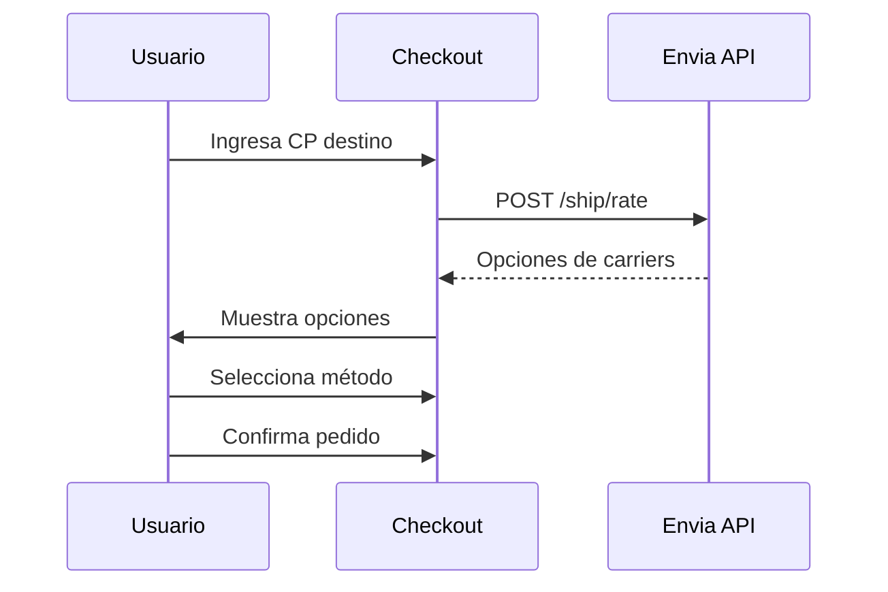

# 🍯 Modhu Honey Store

Tienda en línea de miel artesanal mexicana con panel de administración, sistema de inventario, y API para integraciones externas.


**Live**: [https://mieldesol.com](https://mieldesol.com)

---

## 🚀 Stack Tecnológico

| Capa | Tecnología | Notas |
|------|------------|-------|
| **Runtime** | Node.js 18+ | ES Modules (`type: "module"`) |
| **Framework** | Express 4.x | `src/server.js` es entry point |
| **Base de Datos** | Supabase (PostgreSQL 15) | RLS habilitado |
| **Pagos** | Stripe Checkout | Webhooks para confirmación |
| **Templates** | EJS | En `src/views/` |
| **Hosting** | Vercel (Serverless) | ⚠️ Limitaciones importantes |
| **IA** | Google Gemini | Generación de imágenes |

---

## 📦 Instalación Rápida

```bash
git clone https://github.com/Aprendizia/modhu-honey-store.git
cd modhu-honey-store
npm install
cp env.example .env
# Editar .env con credenciales
npm run dev
# → http://localhost:3000
```

### Modo Demo (Sin Supabase)
Si no tienes credenciales de Supabase, la app funciona en **demo mode** con datos estáticos de `src/data/demo-data.js`.

---

## ⚠️ IMPORTANTE: Particularidades de Vercel Serverless

### 1. Sistema de Archivos Read-Only
```
❌ EROFS: read-only file system
```
**No se pueden guardar archivos en el servidor.** Las imágenes generadas con AI se descargan al navegador del usuario.

### 2. Sesiones NO Persisten
`express-session` NO funciona porque cada request va a una instancia diferente.

**Solución implementada:** Cookies directas para cart y user:

```javascript
// src/server.js - Cart en cookies
res.cookie('cart', JSON.stringify(cart), {
  httpOnly: true,
  maxAge: 7 * 24 * 60 * 60 * 1000,
  sameSite: 'lax',
  secure: process.env.NODE_ENV === 'production'
});

// User session en cookie
res.cookie('user_session', JSON.stringify({
  id: user.id,
  email: user.email,
  role: user.role,
  full_name: user.full_name
}), { ... });
```

### 3. Assets Estáticos
Configurado en `vercel.json`:
```json
{
  "routes": [
    { "src": "/assets/(.*)", "dest": "/modhu/assets/$1" },
    { "src": "/css/(.*)", "dest": "/src/public/css/$1" },
    { "src": "/(.*)", "dest": "/src/server.js" }
  ]
}
```

---

## 🔧 Variables de Entorno

```env
# ============================================
# SUPABASE
# ============================================
SUPABASE_URL=https://xxxxx.supabase.co
SUPABASE_ANON_KEY=eyJ...              # Para operaciones públicas
SUPABASE_SERVICE_ROLE_KEY=eyJ...      # ⚠️ REQUERIDO para bypass RLS

# ============================================
# STRIPE
# ============================================
STRIPE_PUBLIC_KEY=pk_live_...
STRIPE_SECRET_KEY=sk_live_...         # ⚠️ Sin esto, muestra transferencia
STRIPE_WEBHOOK_SECRET=whsec_...       # Para verificar webhooks

# ============================================
# APP
# ============================================
APP_URL=https://tu-dominio.vercel.app # URL de producción
SESSION_SECRET=string-seguro-32-chars
NODE_ENV=production

# ============================================
# GEMINI AI (Opcional)
# ============================================
GEMINI_API_KEY=AIza...                # Desde aistudio.google.com
```

### Configurar en Vercel
```bash
vercel env add SUPABASE_URL
vercel env add STRIPE_SECRET_KEY
# etc...
```

---

## 🗄️ Estructura de Base de Datos

### Tablas Core

| Tabla | Descripción | RLS |
|-------|-------------|-----|
| `profiles` | Usuarios (extends auth.users) | ✅ |
| `products` | Catálogo de productos | ✅ |
| `categories` | Categorías | ✅ |
| `product_variants` | Variantes (tamaños) | - |
| `orders` | Pedidos | ✅ |
| `order_items` | Items de pedido | ✅ |
| `cart_items` | Carrito (usuarios logueados) | ✅ |
| `addresses` | Direcciones de envío | ✅ |
| `reviews` | Reseñas | ✅ |

### Tablas Auxiliares

| Tabla | Descripción |
|-------|-------------|
| `coupons` | Cupones de descuento |
| `coupon_usages` | Uso de cupones |
| `shipping_zones` | Zonas de envío |
| `shipping_rates` | Tarifas por zona |
| `inventory_movements` | Historial de stock |
| `newsletter_subscribers` | Suscriptores |
| `store_settings` | Configuración (JSON) |
| `activity_logs` | Logs de actividad |

### Schema SQL
```bash
# Ejecutar en Supabase SQL Editor en este orden:
1. src/database/schema.sql           # Schema base
2. src/database/schema-upgrade-v4.sql # Funciones adicionales (si existe)
```

### Funciones SQL Disponibles
```sql
-- Generar número de orden
SELECT generate_order_number();  -- → '260001'

-- Stats de ventas
SELECT * FROM get_sales_stats(30);  -- últimos 30 días

-- Productos más vendidos
SELECT * FROM get_top_products(10);

-- Validar cupón
SELECT * FROM validate_coupon('CODIGO', user_id, subtotal);

-- Decrementar stock
SELECT decrement_stock(product_id, quantity);
```

### Row Level Security (RLS)
⚠️ **IMPORTANTE**: Usar `supabaseAdmin` para operaciones server-side que necesiten bypass RLS.

```javascript
// src/config/supabase.js
import { createClient } from '@supabase/supabase-js';

// Cliente público (respeta RLS)
export const supabase = createClient(url, anonKey);

// Cliente admin (bypass RLS) - SOLO en server
export const supabaseAdmin = createClient(url, serviceRoleKey);
```

---

## 📁 Estructura del Proyecto

```
src/
├── server.js                 # Entry point Express
├── config/
│   └── supabase.js          # Clientes Supabase (admin + público)
├── data/
│   └── demo-data.js         # Datos para modo demo
├── database/
│   └── schema.sql           # Schema PostgreSQL completo
├── routes/
│   ├── index.js             # GET /, /about, /contact, /track-order
│   ├── shop.js              # GET /shop, /shop/product/:slug
│   ├── cart.js              # /cart/*, /cart/process-checkout
│   ├── auth.js              # /auth/login, /register, /profile, /orders
│   ├── admin.js             # /admin/* (requiere role=admin)
│   ├── api.js               # /api/status (interno)
│   └── api-v1.js            # /api/v1/* (externo con API key)
├── services/
│   ├── stripe.js            # createCheckoutSession, handleWebhook
│   └── imageGenerator.js    # Gemini AI
├── views/
│   ├── layouts/main.ejs     # Layout base (NO SE USA, include manual)
│   ├── partials/
│   │   ├── header.ejs       # Navbar con carrito
│   │   └── footer.ejs       # Footer con newsletter
│   ├── pages/
│   │   ├── home.ejs         # Hero parallax + productos
│   │   ├── shop.ejs         # Grid de productos
│   │   ├── product-detail.ejs
│   │   ├── cart.ejs
│   │   ├── checkout.ejs     # Formulario de envío
│   │   ├── order-confirmation.ejs
│   │   ├── order-pending.ejs
│   │   ├── about.ejs
│   │   ├── contact.ejs
│   │   ├── track-order.ejs
│   │   └── auth/
│   │       ├── login.ejs
│   │       ├── register.ejs
│   │       ├── profile.ejs
│   │       └── orders.ejs
│   ├── admin/
│   │   ├── dashboard.ejs
│   │   ├── products.ejs
│   │   ├── orders.ejs
│   │   └── images.ejs       # Generador AI
│   └── errors/
│       ├── 404.ejs
│       └── 500.ejs
└── public/
    └── css/
        ├── variables.css    # Design tokens
        ├── components.css   # Botones, cards, forms
        └── animations.css   # Efectos CSS

modhu/                       # Assets estáticos originales
└── assets/
    ├── css/                 # Bootstrap + custom
    ├── js/                  # jQuery, WOW.js
    ├── img/                 # Imágenes de productos, slider, etc.
    └── font/                # Iconos
```

---

## 🛣️ Rutas y Endpoints

### Páginas Públicas (GET)

| Ruta | Archivo | Descripción |
|------|---------|-------------|
| `/` | `routes/index.js` | Home con hero parallax |
| `/shop` | `routes/shop.js` | Catálogo con filtros |
| `/shop/product/:slug` | `routes/shop.js` | Detalle de producto |
| `/about` | `routes/index.js` | Sobre nosotros |
| `/contact` | `routes/index.js` | Contacto |
| `/track-order` | `routes/index.js` | Buscar pedido |

### Carrito (routes/cart.js)

| Método | Ruta | Descripción |
|--------|------|-------------|
| GET | `/cart` | Ver carrito |
| POST | `/cart/add` | Agregar (AJAX, retorna JSON) |
| POST | `/cart/update` | Actualizar cantidad |
| POST | `/cart/remove` | Eliminar item |
| GET | `/cart/checkout` | Formulario de envío |
| POST | `/cart/process-checkout` | Crear orden → Stripe |
| GET | `/cart/success` | Confirmación exitosa |
| GET | `/cart/cancel` | Pago cancelado |
| GET | `/cart/order-pending/:orderNumber` | Orden pendiente |
| POST | `/cart/webhook` | Webhook de Stripe |

### Autenticación (routes/auth.js)

| Método | Ruta | Auth | Descripción |
|--------|------|------|-------------|
| GET | `/auth/login` | No | Formulario login |
| POST | `/auth/login` | No | Procesar login |
| GET | `/auth/register` | No | Formulario registro |
| POST | `/auth/register` | No | Procesar registro |
| GET | `/auth/logout` | Sí | Cerrar sesión |
| GET | `/auth/profile` | Sí | Ver perfil |
| GET | `/auth/orders` | Sí | Mis pedidos |

### Admin (routes/admin.js)
**Requiere**: `req.session.user.role === 'admin'`

| Ruta | Descripción |
|------|-------------|
| `/admin` | Dashboard con métricas |
| `/admin/products` | Gestión de productos |
| `/admin/orders` | Gestión de pedidos |
| `/admin/images` | Generador de imágenes AI |

### API Interna (routes/api.js)

| Método | Ruta | Descripción |
|--------|------|-------------|
| GET | `/api/status` | Estado de configuración |

### API Externa v1 (routes/api-v1.js)
**Requiere**: Header `X-API-Key`

| Método | Ruta | Descripción |
|--------|------|-------------|
| GET | `/api/v1/products` | Lista productos |
| GET | `/api/v1/products/:id` | Detalle producto |
| GET | `/api/v1/orders` | Lista pedidos |
| PUT | `/api/v1/orders/:id/status` | Actualizar estado |
| GET | `/api/v1/inventory` | Resumen inventario |

---

## 🔐 Autenticación y Roles

### Flujo de Login
```
1. Usuario envía email/password
2. Supabase Auth valida credenciales
3. Se busca profile en tabla profiles
4. Se guarda en cookie user_session
5. Middleware lee cookie y popula req.session.user
```

### Roles
| Rol | Acceso |
|-----|--------|
| `customer` | Tienda, carrito, perfil, pedidos propios |
| `admin` | Todo + panel admin |
| `manager` | (Futuro) Acceso limitado a admin |

### Crear Admin
```sql
-- En Supabase SQL Editor
UPDATE profiles SET role = 'admin' WHERE email = 'tu@email.com';
```

### Middleware de Auth
```javascript
// Verificar login
const requireAuth = (req, res, next) => {
  if (!req.session.user) {
    return res.redirect('/auth/login');
  }
  next();
};

// Verificar admin
const requireAdmin = (req, res, next) => {
  if (!req.session.user || req.session.user.role !== 'admin') {
    return res.status(403).render('errors/403');
  }
  next();
};
```

---

## 💳 Integración Stripe

### Flujo de Checkout
```
1. Usuario llena formulario de envío
2. POST /cart/process-checkout
3. Se crea orden en Supabase (status: pending)
4. Se crea Stripe Checkout Session
5. Redirect a Stripe
6. Usuario paga
7. Stripe envía webhook
8. Se actualiza orden (status: paid)
9. Redirect a /cart/success
```

### Crear Checkout Session
```javascript
// src/services/stripe.js
export async function createCheckoutSession(order, lineItems, successUrl, cancelUrl) {
  const session = await stripe.checkout.sessions.create({
    payment_method_types: ['card'],
    line_items: lineItems,
    mode: 'payment',
    success_url: successUrl,
    cancel_url: cancelUrl,
    metadata: {
      order_id: order.id,
      order_number: order.order_number
    }
  });
  return session;
}
```

### Webhook
```javascript
// POST /cart/webhook
export async function handleWebhook(payload, signature, webhookSecret) {
  const event = stripe.webhooks.constructEvent(payload, signature, webhookSecret);
  
  if (event.type === 'checkout.session.completed') {
    const session = event.data.object;
    // Actualizar orden en Supabase
  }
}
```

### Monto Mínimo
Stripe requiere **mínimo $10 MXN**. Hay validación antes de crear sesión.

---

## 🎨 Design System

### CSS Variables (src/public/css/variables.css)
```css
:root {
  /* Colores - Miel de Sol */
  --ivory: #F6F1E6;      /* Fondo principal */
  --charcoal: #141414;   /* Texto principal */
  --gold: #C79A2A;       /* Accent, CTAs */
  --amber: #A56B1F;      /* Hover states */
  --sand: #E8DDC8;       /* Cards, borders */
  --smoke: #6B6B6B;      /* Texto secundario */
  --night: #0F2437;      /* Fondo oscuro */
  --white: #FFFFFF;
  
  /* Tipografía */
  --font-display: 'Cormorant Garamond', serif;  /* Headlines */
  --font-body: 'Inter', sans-serif;             /* Body/UI */
  
  /* Layout */
  --max: 1160px;
  --radius: 16px;
  --radius-sm: 8px;
  --radius-lg: 20px;
  --radius-pill: 999px;
  
  /* Sombras */
  --shadow-soft: 0 12px 30px rgba(20,20,20,.06);
  --shadow-card: 0 4px 20px rgba(20,20,20,.04);
  --shadow-hover: 0 16px 40px rgba(20,20,20,.08);
}
```

### Clases de Componentes
- `.btn`, `.btn-primary`, `.btn-secondary`, `.btn-outline`
- `.card`, `.card-solid`, `.product-card`
- `.form-group`, `.form-input`, `.form-label`, `.form-select`
- `.section`, `.section-header`, `.container`
- `.alert`, `.alert-success`, `.alert-error`, `.alert-warning`

### Estética
- Warm, minimal, editorial
- Alto whitespace
- Bordes suaves (8-20px radius)
- Sombras sutiles

---

## 🖼️ Generación de Imágenes con AI

### Ubicación
`/admin/images` (requiere admin)

### Servicio (src/services/imageGenerator.js)
```javascript
import { GoogleGenerativeAI } from '@google/generative-ai';

export async function generateImage(prompt, width, height, model) {
  const genAI = new GoogleGenerativeAI(process.env.GEMINI_API_KEY);
  const modelInstance = genAI.getGenerativeModel({ model });
  const result = await modelInstance.generateContent(prompt);
  // Retorna base64 que se descarga al navegador
}
```

### Prompts Predefinidos
Ver `docs/IMAGE_GENERATION_GUIDE.md`

---

## 🐛 Problemas Conocidos y Soluciones

### 1. Carrito se vacía al cambiar página
**Causa**: Sessions no persisten en Vercel
**Solución**: Usar cookies (ya implementado)

### 2. Login no persiste
**Causa**: Misma que carrito
**Solución**: Guardar user en cookie (ya implementado)

### 3. Pedidos no aparecen en "Mis Pedidos"
**Causa**: RLS bloqueaba queries
**Solución**: Usar `supabaseAdmin` + buscar por email también

```javascript
const { data: orders } = await supabaseAdmin
  .from('orders')
  .select('*')
  .or(`user_id.eq.${userId},customer_email.eq.${userEmail}`);
```

### 4. Stripe muestra transferencia en vez de tarjeta
**Causa**: `STRIPE_SECRET_KEY` no configurada
**Solución**: Agregar variable en Vercel

### 5. Imágenes AI no se guardan
**Causa**: Vercel filesystem es read-only
**Solución**: Descargar al navegador del usuario

---

## 📝 Comandos de Desarrollo

```bash
# Desarrollo local
npm run dev

# Producción local
npm start

# Deploy (automático con push)
git push origin main

# Deploy manual
vercel --prod

# Logs
vercel logs --follow
```

---

## 🔄 Git Workflow

```bash
# Feature
git checkout -b feature/nueva-funcion
# ... hacer cambios
git add -A
git commit -m "✨ Add: descripción"
git push origin feature/nueva-funcion
# PR → main

# Hotfix
git checkout main
git pull
# ... fix
git commit -m "🐛 Fix: descripción"
git push
```

### Convención de Commits
- ✨ `Add:` Nueva funcionalidad
- 🐛 `Fix:` Corrección de bug
- 📝 `Docs:` Documentación
- 🎨 `Style:` UI/CSS
- ♻️ `Refactor:` Refactorización
- 🔧 `Config:` Configuración

---

## 📊 Debugging

### Endpoint de Status
```bash
curl https://tu-dominio.vercel.app/api/status
```

Respuesta:
```json
{
  "success": true,
  "environment": "production",
  "supabase": { "configured": true, "mode": "production" },
  "stripe": { "configured": true, "keyPrefix": "sk_live..." },
  "app": { "url": "https://..." }
}
```

### Logs de Vercel
```bash
vercel logs --follow
```

### Variables en Server
```javascript
console.log('🔑 Stripe configured:', !!process.env.STRIPE_SECRET_KEY);
console.log('🗄️ Supabase URL:', process.env.SUPABASE_URL);
```

---

---

## 📦 Integración Envia.com (Envíos)

### Configuración

1. Crear cuenta en [Envia.com](https://envia.com)
2. Generar API Key en el dashboard
3. Agregar variables de entorno:

```env
ENVIA_API_KEY=tu-api-key
ENVIA_ORIGIN_POSTAL_CODE=91000
ENVIA_ORIGIN_CITY=Xalapa
ENVIA_ORIGIN_STATE=VE
```

### Endpoints de Shipping

| Método | Ruta | Descripción |
|--------|------|-------------|
| POST | `/api/shipping/quote` | Cotizar envío en tiempo real |
| POST | `/api/shipping/label` | Generar guía (admin) |
| GET | `/api/shipping/track/:tracking` | Rastrear envío |
| POST | `/api/shipping/pickup` | Programar recolección |
| DELETE | `/api/shipping/cancel/:labelId` | Cancelar envío |

### Flujo de Checkout con Envío



### Carriers Soportados

- Estafeta
- FedEx
- DHL Express
- Redpack
- Paquete Express
- 99 Minutos

### Tabla `shipments`

```sql
CREATE TABLE shipments (
    id UUID PRIMARY KEY,
    order_id UUID REFERENCES orders(id),
    carrier VARCHAR(50),
    tracking_number VARCHAR(100),
    label_url TEXT,
    status VARCHAR(30),
    created_at TIMESTAMP DEFAULT NOW()
);
```

---

## 🚀 Mejoras Pendientes

- [ ] Búsqueda de productos con Algolia/Meilisearch
- [ ] Emails transaccionales (Resend/SendGrid)
- [ ] PWA support
- [ ] Multi-idioma (i18n)
- [ ] Tests con Jest
- [ ] CI/CD con GitHub Actions
- [ ] Caché con Redis/Upstash
- [ ] CDN para imágenes (Cloudinary)

---

## 📄 Licencia

MIT © 2026 Modhu Honey Store

---

## 🆘 Soporte

- 📖 Ver `CHANGELOG.md` para historial detallado
- 📖 Ver `docs/IMAGE_GENERATION_GUIDE.md` para prompts de AI
- 🐛 Issues: GitHub Issues

---

*Hecho con 🍯 en México*
